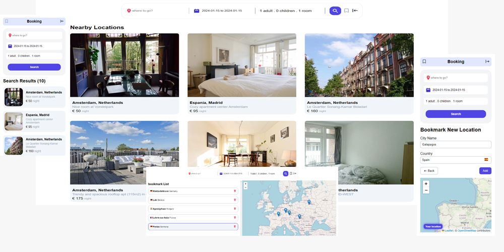

# Booking Hotel

This is link Demo [Booking Hotel]()

This project is a booking hotel that is implemented with React.
The project features include:

- location list
- Bookmark
- Add Bookmark
- Registration
- map
- ProtectedRoute

The technology used in the project includes:

- context
- custom css
- [react-date-range](https://www.npmjs.com/package/react-date-range)
- [react-leaflet](https://react-leaflet.js.org/)
- ...

This template provides a minimal setup to get React working in Vite with HMR and some ESLint rules.

Currently, two official plugins are available:

- [@vitejs/plugin-react](https://github.com/vitejs/vite-plugin-react/blob/main/packages/plugin-react/README.md) uses [Babel](https://babeljs.io/) for Fast Refresh
- [@vitejs/plugin-react-swc](https://github.com/vitejs/vite-plugin-react-swc) uses [SWC](https://swc.rs/) for Fast Refresh
